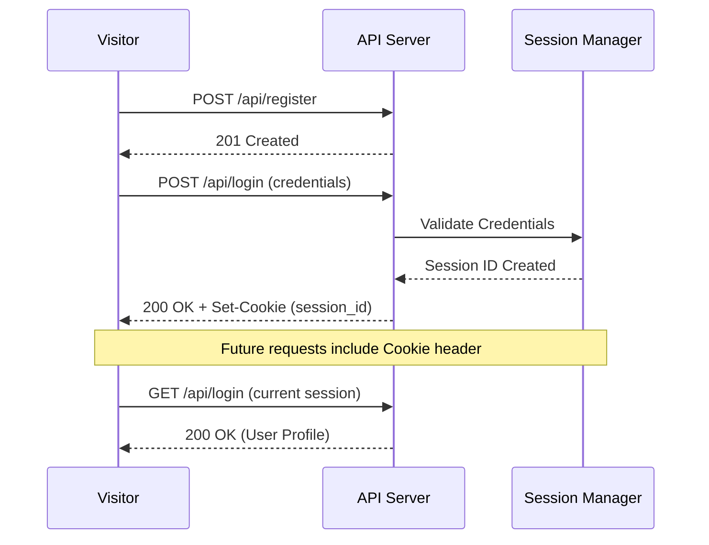
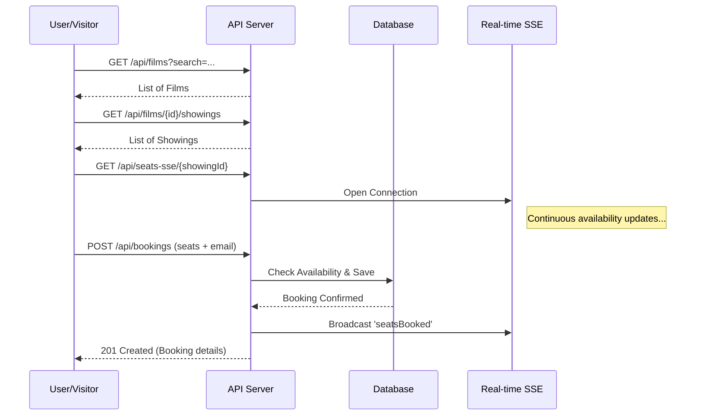

# Filmvisarna API Contract

This document describes the API for the Filmvisarna AB cinema system.

## API Overview
- **Base URL:** `http://localhost:3000` (development) / `https://api.filmvisarna.se` (production)
- **API Version:** 1.0.0
- **Format:** All requests/responses are JSON (UTF-8) unless specified (e.g., SSE).

---

## Common Headers

| Header | Value | Purpose |
| :--- | :--- | :--- |
| `Content-Type` | `application/json` | Required for all `POST` and `PUT` requests. |
| `Accept` | `application/json` | Preferred for all requests. |
| `Cookie` | `session_id=...` | Used for session-based authentication. |

---

## Global Data Formats & Constraints

- **Date & Time:** [ISO 8601](https://en.wikipedia.org/wiki/ISO_8601) format: `YYYY-MM-DDTHH:mm:ss`.
- **Currency:** All prices are in SEK (Swedish Krona) as floating-point numbers (e.g., `149.00`).
- **Language:** API messages (errors/success) are currently provided in Swedish.
- **Booleans:** Represented as numbers (`0` or `1`) or native JSON booleans (`true`/`false`).

---

## Global Response Conventions

### Error format (standard)
All error responses SHOULD use:
```json
{ "error": "Human readable message." }
```

### Status Codes
- **200 OK** -- Successful request
- **201 Created** -- Resource created
- **400 Bad Request** -- Invalid input
- **401 Unauthorized** -- Not logged in / invalid session
- **403 Forbidden** -- Not allowed (wrong role)
- **404 Not Found** -- Resource missing
- **405 Method Not Allowed** -- Action not allowed (ACL block)
- **409 Conflict** -- Resource already exists

---

## Core Flows

### 1. Authentication Flow


### 2. Film Discovery & Booking Flow


---

## Authentication & Authorization

### Roles (from ACL)
- `visitor` ==> Not logged in
- `user` ==> Logged-in user
- `staff` ==> filmvisarna's employee
- `admin` ==> full system access

### Note:
- Registration always creates a `user`.
- `staff` and `admin` are created manually in the database.
- ACL controls access to all routes.

---

## Authentication Routes

### POST /api/register
Create a new user account.
**ACL:** `visitor` (allow)

#### Request Body
```json
{
  "email": "fatima@unesco.org",
  "firstName": "Fatima",
  "lastName": "Al-Murtadha",
  "phoneNumber": "4765774921",
  "password": "123456"
}
```

#### Responses
- **201 Created**: `{ "message": "Ditt konto har registrerats." }`
- **400 Bad Request**: `{ "error": "Ogiltig information." }`
- **409 Conflict**: `{ "error": "Email redan finns." }`

### POST /api/login
Login and create a session.
**ACL:** `visitor` (allow)

#### Request Body
```json
{
  "email": "fatima@unesco.org",
  "password": "123456"
}
```

#### Responses
- **200 OK**:
  ```json
  {
    "id": 3,
    "email": "fatima@unesco.org",
    "firstName": "Fatima",
    "lastName": "Al-Murtadha",
    "role": "user"
  }
  ```
- **401 Unauthorized**: `{ "error": "Fel lösenord." }` or `{ "error": "Ingen användare hittades." }`

### GET /api/login
Get the current authenticated user session.
**ACL:** `user, staff, admin` (allow)

#### Responses
- **200 OK**: Current user object (same as POST /api/login)
- **401 Unauthorized**: `{ "error": "No user is logged in." }`

### DELETE /api/login
Logout and destroy current session.
**ACL:** `user, staff, admin` (allow)

#### Responses
- **200 OK**: `{ "status": "Successful logout." }`
- **401 Unauthorized**: `{ "error": "No user is logged in." }`

---

## Films & Showings

### GET /api/films
List all films with optional filtering.
**ACL:** `visitor, user, staff, admin` (allow)

#### Query Parameters
- `search` (optional): Filter by title (substring)
- `genre` (optional): Filter by exact genre
- `ageLimit` (optional): Filter by exact age limit

#### Responses
- **200 OK**:
  ```json
  [
    {
      "id": 1,
      "title": "Avatar 3",
      "genre": "Science fiction",
      "release_year": 2025,
      "age_limit": 12,
      "poster_url": "avatar3.jpg",
      "is_featured": 1
    }
  ]
  ```

### GET /api/films/{id}
Get full film details.
**ACL:** `visitor, user, staff, admin` (allow)

#### Responses
- **200 OK**:
  ```json
  {
    "id": 1,
    "title": "Avatar 3",
    "duration_minutes": 192,
    "genre": "Science fiction",
    "release_year": 2025,
    "age_limit": 12,
    "description": "...",
    "language": "Svenska",
    "poster_url": "avatar3.jpg",
    "trailer_url": "...",
    "is_featured": 1,
    "actors": ["Oskar Gyllenör", "Zoe Saldaña"]
  }
  ```
- **404 Not Found**: `{ "error": "Filmen finns inte." }`

### GET /api/films/{filmId}/showings
Get all showings for a specific film.
**ACL:** `visitor, user, staff, admin` (allow)

#### Responses
- **200 OK**:
  ```json
  [
    {
      "id": 1,
      "film_id": 1,
      "hall_id": 1,
      "start_time": "2026-03-01T18:00:00",
      "hall_name": "Stora salongen"
    }
  ]
  ```

---

## Booking System

### POST /api/bookings
Create a new booking.
**ACL:** `visitor, user, staff, admin` (allow)

#### Request Body
```json
{
  "showing_id": 1,
  "email": "visitor@example.com",
  "tickets": [
    { "ticket_type_id": 1, "seat_id": 45 },
    { "ticket_type_id": 2, "seat_id": 46 }
  ]
}
```

#### Responses
- **201 Created**:
  ```json
  {
    "id": 10,
    "booking_number": "BK1234",
    "booking_status": "confirmed",
    "film_title": "Avatar 3",
    "hall_name": "Stora salongen",
    "start_time": "2026-03-01T18:00:00",
    "total_price": 220.00
  }
  ```
- **400 Bad Request**: `{ "error": "En eller flera platser är redan bokade." }`

### POST /api/bookings/cancel
Cancel an existing booking. Must be done at least 2 hours before the show.
**ACL:** `visitor, user, staff, admin` (allow, with ownership check)

#### Request Body
```json
{
  "booking_number": "BK1234",
  "email": "visitor@example.com"
}
```

#### Responses
- **200 OK**: `{ "message": "Bokningen har avbokats." }`
- **400 Bad Request**: `{ "error": "Avbokning måste ske minst 2 timmar innan visningen." }`

### GET /api/bookings/my
Get all bookings for the current logged-in user.
**ACL:** `user, staff, admin` (allow)

#### Responses
- **200 OK**:
  ```json
  [
    {
      "id": 10,
      "booking_number": "BK1234",
      "booking_status": "confirmed",
      "total_price": 220.00,
      "film_title": "Avatar 3",
      "start_time": "2026-03-01T18:00:00"
    }
  ]
  ```

---

## AI Assistant

### POST /api/chat
Proxy chat requests to AI API.
**ACL:** `visitor, user, staff, admin` (allow)

#### Request Body
```json
{
  "messages": [
    { "role": "user", "content": "What movies are playing today?" }
  ]
}
```

#### Responses
- **200 OK**: Standard AI response object.

---

## Real-time Updates (SSE)

### GET /api/seats-sse/{showingId}
Server-Sent Events for real-time seat availability updates.
**ACL:** `visitor, user, staff, admin` (allow)

#### Events
- `seatsBooked`: `{ "showing_id": 1, "seat_id": 45 }`
- `seatsReleased`: `{ "showing_id": 1, "released_seats": [45, 46] }`

---

## Generic REST API (Table Access)

The following routes provide standard CRUD access to database tables, subject to ACL rules.

### Routes
- `GET /api/{table}` -- List all rows (supports filters)
- `GET /api/{table}/{id}` -- Get single row
- `POST /api/{table}` -- Create new row
- `PUT /api/{table}/{id}` -- Update row
- `DELETE /api/{table}/{id}` -- Delete row

### Common Tables
- `halls`
- `seats`
- `ticket_types`
- `ticket_prices`
- `actors`
- `showings`

---

## Security & Best Practices
- **Session Expiry:** Inactive sessions expire after 30 minutes.
- **CSRF:** All `POST`/`PUT`/`DELETE` operations require a valid session cookie.
- **Rate Limiting:** Maximum 100 requests per minute per IP to prevent abuse.
- **SSL:** Mandatory for all production environments.
